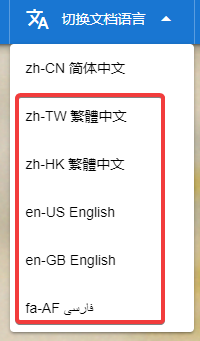

# rainbow-outline-text
 rainbow-outline-text - rainbow outline text.
# rainbow-outline-text Document
 Check out document: [rainbow-outline-text Document](https://cnoctave.github.io/rainbow-outline-text/index.html)
# How to translate rainbow-outline-text Document into another language
 In ./docs directory, index.html is zh-CN simplified Chinese document. 
 For example, if you want to translate document into English.
 1. Copy index.html as another document with different language code as filename, 
 for example, en-US.html.
 2. Translate en-US.html into English.
 3. Add dropdown like the picture below to every *.html. 
 For example, add dropdown "en-US English".  
   
 The code for adding dropdown is like the picture below.  
  
 4. PR to rainbow-outline-text.